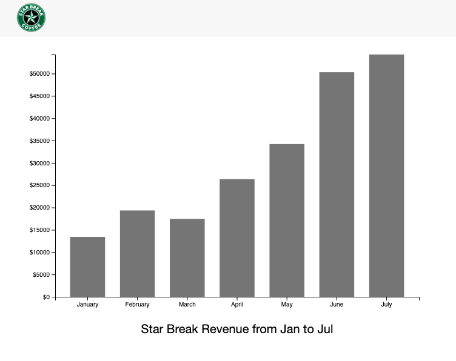

# d3RevenueGraph

A simple bar graph that visualizes revenue over a period of seven months. Coursework from a udemy course called, "Mastering data visualization in D3.js."

## To begin

`python3 -m http.server`

View in http://localhost:8000/

<iframe src="https://giphy.com/embed/MYCGGq2hiczazT4UGc" width="480" height="304" frameBorder="0" class="giphy-embed" allowFullScreen></iframe>
<a href="https://giphy.com/gifs/MYCGGq2hiczazT4UGc">via GIPHY</a>

